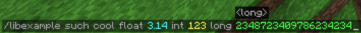

# Funmands - The *Declarative* Command Framework

Since the Minecraft update in 1.13, commands have
undergone a massive overhaul, mainly because of Mojang's
command system, Brigadier. Brigadier allows
for fancy syntax validation on the client-side,
like this:


### Reasoning
Although this looks cool, creating the commands is...
horrible. This is how creating this command looks with
raw brigadier:
```java
    LiteralArgumentBuilder.literal("libexample")
    .then(LiteralArgumentBuilder.literal("such")
    .then(LiteralArgumentBuilder.literal("cool")
    .then(LiteralArgumentBuilder.literal("float")
    .then(RequiredArgumentBuilder.argument("float", FloatArgumentType.floatArg())
    .then(LiteralArgumentBuilder.literal("int")
    .then(RequiredArgumentBuilder.argument("int", IntegerArgumentType.integer())
    .then(LiteralArgumentBuilder.literal("long")
    .then(RequiredArgumentBuilder.argument("long", LongArgumentType.longArg()).executes(context -> {
        // do command logic here
        return Command.SINGLE_SUCCESS;
    })))))))));
```

The above is extremely verbose and imperative. Here is what it looks
like to create this command structure, known as a ***format***
in Funmands:
```java
withFormat("such cool float <float:float> int <int:int> long <long:long>", context -> {
    // do command logic here
});
```

### Design Philosophy
Existing command frameworks such as
[CommandAPI](https://docs.commandapi.dev/) and
[Cloud](https://cloud.incendo.org/) adopt an imperative ideology
when creating commands. On the other hand, Funmands adopts a
completely declarative approach to commands. You describe *what*
you want to do, not *how* you want to do it. There is exactly
**1** way to do something in the framework, as I don't like
convoluted, bloated frameworks.

### Getting Started
To get started with Funmands, view [Getting Started](docs/getting-started.md).